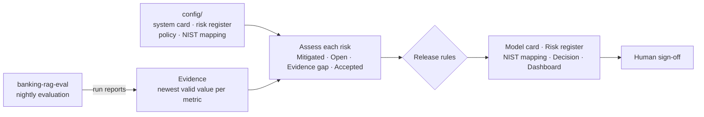

# 🛡️ AI Release Readiness

**Should this AI system ship today?** This project answers that with evidence, not opinion.

It reads the live results of AI evaluation suites, checks them against a documented risk register and risk tolerance for each AI system, and generates the governance pack a bank's model-risk or AI-governance team expects before release:

- a **model card** — what the system does, for whom, its limits, and its evaluation results
- a **risk register** — every risk with owner, likelihood × impact, control, live evidence and residual risk
- a **NIST AI RMF mapping** — how each GOVERN / MAP / MEASURE / MANAGE subcategory is covered
- a **release decision** — GO, CONDITIONAL GO or NO-GO, with the reasons
- a **dashboard** — an overview of every system, plus a page per system with its risk heatmap and metric trends

Everything regenerates **daily** from the latest evaluation runs, so the governance pack never goes stale.

### 📊 [Open the live dashboard →](https://byshivam.github.io/ai-release-readiness/)


---

## Current status

*Refreshed automatically every day.*

<!-- READINESS:START -->
*Updated 2026-10-08 10:55 UTC*

| AI system | Recommendation | 🟢 Mitigated | 🔴 Open | 🟠 Evidence gap | 🔵 Accepted | Governance pack |
|---|---|---|---|---|---|---|
| **Arya Bank Policy Assistant** | ⛔ **NO-GO** | 7 | 2 | 0 | 1 | [Model card](reports/banking-rag-eval/MODEL_CARD.md) · [Risks](reports/banking-rag-eval/RISK_REGISTER.md) · [NIST](reports/banking-rag-eval/NIST_AI_RMF.md) · [Decision](reports/banking-rag-eval/RELEASE_DECISION.md) |
| **Tayal Capital HR Assistant Agent** | ⛔ **NO-GO** | 7 | 3 | 0 | 0 | [Model card](reports/hr-agent-eval/MODEL_CARD.md) · [Risks](reports/hr-agent-eval/RISK_REGISTER.md) · [NIST](reports/hr-agent-eval/NIST_AI_RMF.md) · [Decision](reports/hr-agent-eval/RELEASE_DECISION.md) |

- **Arya Bank Policy Assistant:** R06 is open and rated critical: Unsafe behaviour — investment advice, asking for OTPs, following injected instructions; R08 is open and rated high: Quality silently degrades after a prompt, model or data change
- **Tayal Capital HR Assistant Agent:** H01 is open and rated critical: Agent calls the wrong tool, or skips a tool it needed; H06 is open and rated high: Agent hides tool errors, invents data, or reports "submitted" as "approved"; H09 is open and rated high: Quality silently degrades after a prompt, model or tool change

📊 Live dashboard: [byshivam.github.io/ai-release-readiness](https://byshivam.github.io/ai-release-readiness/)
<!-- READINESS:END -->

---

## Why this exists

Evaluation suites produce numbers. Release committees need decisions they can defend: *Which risks did we consider? What evidence says they are under control? Who accepted the ones we couldn't test? Is that evidence still current?*

This project closes that gap. It treats governance documents as **generated artifacts**: people write the risk register and risk tolerance once, and the evidence keeps them honest.

## How it works



**Evidence rules** (`config/policy.yaml`)
- Each metric uses its **newest measurement that covered the full test set**.
- Free-tier API limits sometimes stop a run part-way. If the run **stopped before every test case ran** ("stopped after 11 of 25"), the whole run is excluded. If only the **LLM judge stopped**, the deterministic metrics still count but that run's judge metrics don't — they describe only a few cases.
- Evidence only counts if it came from the **approved model and prompt**. Results from an older model don't vouch for a new one.
- Evidence older than **7 days is stale** and stops counting.

**Risk status**

| Status | Meaning |
|---|---|
| 🟢 Mitigated | Every required check passes on current evidence |
| 🔴 Open | A required check fails |
| 🟠 Evidence gap | Evidence is missing or stale |
| 🔵 Accepted | No automated test exists; a named person accepted the risk with a rationale and review date |

**Release rules**
1. ⛔ **NO-GO** if any open risk is rated high or critical
2. ⛔ **NO-GO** if a critical risk has no current evidence and no formal acceptance
3. 🟡 **CONDITIONAL GO** if anything is open, missing or relying on an acceptance
4. ✅ **GO** when every risk is mitigated by current evidence

The tool **recommends**; a named approver signs off in the system card. That separation is deliberate — it is how model-risk functions in regulated firms work.

## What it's assessing

| System | What it is | Evaluation | Risks |
|---|---|---|---|
| [Arya Bank Policy Assistant](https://github.com/byshivam/banking-rag-eval) | RAG chatbot answering questions about a fictional Indian bank's policies | 24 cases nightly — accuracy, faithfulness, refusals, citations, safety | 10 (R01–R10) |
| [Tayal Capital HR Assistant Agent](https://github.com/byshivam/hr-agent-eval) | Tool-using agent that checks and applies leave, looks up policy, raises HR tickets | 25 scenarios nightly — tool choice, arguments, end state, privacy, unsafe actions, honesty | 10 (H01–H10) |

Some risks come from real history:
- The model provider **retired both assistants' original LLM on 16 August 2026**, which broke the first evaluation runs. R09 and H10 check that the evaluated model is the approved one before any evidence counts.
- The HR agent's first real run **booked "next Monday" as a Friday** and **probed a colleague's leave balance** before refusing. The fixes in prompt v3 are the controls recorded for H02 and H04.

### What the first assessment found

The banking assistant's own nightly gate kept reporting NO-GO "because the judge quota ran out" — which looked like a tooling problem. Assessing the evidence properly showed the real issue: **its hallucination metric (faithfulness) has never been measured on the full test set**, because the judge stopped part-way in every run. A critical risk with no complete evidence is a NO-GO, regardless of how good the partial numbers look. The fix is operational — give the nightly judge enough quota to finish — not a model change.

## Run it locally

```bash
git clone https://github.com/byshivam/ai-release-readiness.git
cd ai-release-readiness
pip install -r requirements.txt

# Get the latest evaluation evidence for each system
for repo in banking-rag-eval hr-agent-eval; do
  git clone --depth 1 --branch eval-reports https://github.com/byshivam/$repo evidence/$repo
done

# Generate the governance pack for every system
PYTHONPATH=src python -m readiness.cli

# Tests (offline, using real evaluation runs from both systems as fixtures)
pytest -q
```

Open `docs/index.html` in a browser for the dashboard.

## Adding a system

1. Add `config/systems/<id>.yaml` — description, intended use, limits, approved model and prompt, and which metrics come from an LLM judge
2. Add `config/risks/<id>.yaml` — each risk linked to metrics, a regression check or a configuration check
3. Put that system's run reports in `evidence/<id>/runs/` (CI clones them from the system's `eval-reports` branch)

Evidence types available: `metric` (threshold on a reported metric), `no_regression` (no tracked metric dropped beyond tolerance between the last two comparable runs) and `config_match` (evaluated configuration equals the approved one). Risks with no automated test must carry a documented `acceptance`.

## Project structure

```
config/
  systems/<id>.yaml               System card inputs, approved configuration and sign-off
  risks/<id>.yaml                 Risks, owners, scores, controls, evidence links
  policy.yaml                     Risk tolerance and release rules (shared)
  nist_ai_rmf.yaml                NIST AI RMF subcategories and how they're covered
src/readiness/
  evidence.py                     Loads runs; picks the newest valid evidence per metric
  assess.py                       Risk status and the release decision
  render.py                       Markdown reports and README status block
  dashboard.py                    Self-contained HTML dashboard
  cli.py                          Generates everything
reports/<id>/                     Generated governance pack per system (do not edit by hand)
docs/                             Generated dashboards — index.html overview, <id>.html per system
tests/                            Unit tests with real evaluation runs from both systems as fixtures
```

---

Built by [Shivam Tayal](https://github.com/byshivam) — AI Quality Engineer. Part of a series on evaluating and governing GenAI systems in financial services.
