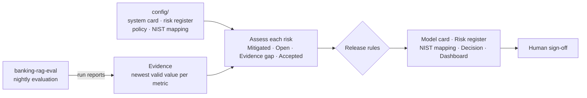

# 🛡️ AI Release Readiness

**Should this AI system ship today?** This project answers that with evidence, not opinion.

It reads the live results of an AI evaluation suite, checks them against a documented risk register and risk tolerance, and generates the governance pack a bank's model-risk or AI-governance team expects before release:

- a **model card** — what the system does, for whom, its limits, and its evaluation results
- a **risk register** — every risk with owner, likelihood × impact, control, live evidence and residual risk
- a **NIST AI RMF mapping** — how each GOVERN / MAP / MEASURE / MANAGE subcategory is covered
- a **release decision** — GO, CONDITIONAL GO or NO-GO, with the reasons
- a **dashboard** — one page with the decision, risk heatmap and metric trends

Everything regenerates **daily** from the latest evaluation runs, so the governance pack never goes stale.


---

## Current status

*Refreshed automatically every day.*

<!-- READINESS:START -->
**Arya Bank Policy Assistant** — 🟡 **CONDITIONAL GO** · updated 2026-10-07 08:10 UTC

| Risks | 🟢 Mitigated | 🔴 Open | 🟠 Evidence gap | 🔵 Accepted |
|---|---|---|---|---|
| 10 | 9 | 0 | 0 | 1 |

**Why:** R10 — accepted: Personal or confidential customer data is exposed in answers

📄 [Model card](reports/MODEL_CARD.md) · [Risk register](reports/RISK_REGISTER.md) · [NIST AI RMF mapping](reports/NIST_AI_RMF.md) · [Release decision](reports/RELEASE_DECISION.md) · [Dashboard](docs/index.html)
<!-- READINESS:END -->

---

## Why this exists

Evaluation suites produce numbers. Release committees need decisions they can defend: *Which risks did we consider? What evidence says they are under control? Who accepted the ones we couldn't test? Is that evidence still current?*

This project closes that gap. It treats governance documents as **generated artifacts**: people write the risk register and risk tolerance once, and the evidence keeps them honest.

## How it works



**Evidence rules** (`config/policy.yaml`)
- Each metric uses its **newest valid measurement** — so a run that stopped part-way (for example when the free-tier LLM judge ran out of quota) still contributes the metrics it did complete.
- Evidence only counts if it came from the **approved model and prompt**. Results from an older model don't vouch for a new one.
- Evidence older than **7 days is stale** and stops counting.

**Risk status**

| Status | Meaning |
|---|---|
| 🟢 Mitigated | Every required check passes on current evidence |
| 🔴 Open | A required check fails |
| 🟠 Evidence gap | Evidence is missing or stale |
| 🔵 Accepted | No automated test exists; a named person accepted the risk with a rationale and review date |

**Release rules**
1. ⛔ **NO-GO** if any open risk is rated high or critical
2. ⛔ **NO-GO** if a critical risk has no current evidence and no formal acceptance
3. 🟡 **CONDITIONAL GO** if anything is open, missing or relying on an acceptance
4. ✅ **GO** when every risk is mitigated by current evidence

The tool **recommends**; a named approver signs off in the system card. That separation is deliberate — it is how model-risk functions in regulated firms work.

## What it's assessing

The first system is the [Banking RAG Evaluation Suite](https://github.com/byshivam/banking-rag-eval): an assistant that answers questions about a fictional Indian bank's policies, evaluated nightly on 24 cases for accuracy, faithfulness, refusals, citations and safety. Ten risks are tracked — from hallucination and wrong fees to third-party model retirement and privacy.

One of those risks is real history: the model provider **retired the assistant's original LLM on 16 August 2026**, which broke the first evaluation run. That is why R09 checks that the evaluated model is the approved one before any evidence counts.

## Run it locally

```bash
git clone https://github.com/byshivam/ai-release-readiness.git
cd ai-release-readiness
pip install -r requirements.txt

# Get the latest evaluation evidence
git clone --depth 1 --branch eval-reports https://github.com/byshivam/banking-rag-eval evidence/banking-rag-eval

# Generate the governance pack
PYTHONPATH=src python -m readiness.cli --evidence evidence/banking-rag-eval

# Tests (offline, using two real evaluation runs as fixtures)
pytest -q
```

Open `docs/index.html` in a browser for the dashboard.

## Adding a system

1. Add `config/systems/<id>.yaml` (description, intended use, limits, approved configuration)
2. Add its risks to a register, each linked to metrics, a regression check or a configuration check
3. Point the CLI at that system's evaluation reports

Evidence types available: `metric` (threshold on a reported metric), `no_regression` (no tracked metric dropped beyond tolerance between the last two comparable runs) and `config_match` (evaluated configuration equals the approved one). Risks with no automated test must carry a documented `acceptance`.

## Project structure

```
config/
  systems/banking-rag-eval.yaml   System card inputs and sign-off
  risk_register.yaml              Risks, owners, scores, controls, evidence links
  policy.yaml                     Risk tolerance and release rules
  nist_ai_rmf.yaml                NIST AI RMF subcategories and how they're covered
src/readiness/
  evidence.py                     Loads runs; picks the newest valid evidence per metric
  assess.py                       Risk status and the release decision
  render.py                       Markdown reports and README status block
  dashboard.py                    Self-contained HTML dashboard
  cli.py                          Generates everything
reports/                          Generated governance pack (do not edit by hand)
docs/index.html                   Generated dashboard
tests/                            Unit tests with real evaluation runs as fixtures
```

---

Built by [Shivam Tayal](https://github.com/byshivam) — AI Quality Engineer. Part of a series on evaluating and governing GenAI systems in financial services.
